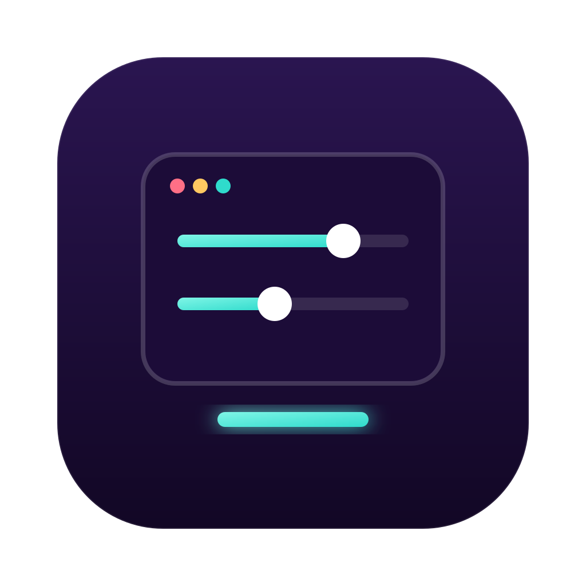

<div align="center">



# BLANK3.0

**Громкость каждого приложения отдельно — прямо из строки меню macOS.**
Сделайте Discord тише, а музыку громче. Бесплатно и с открытым кодом.

[](https://github.com/sluntik33-hub/blank-mixer/releases/latest)


</div>

---

## ✨ Возможности

- 🎚 **Громкость для каждого приложения:** браузер, Spotify, Discord, Telegram, игры.
- 🔇 **Mute в один клик** для любого приложения, плюс кнопка «заглушить все».
- 🔊 **Общая громкость** синхронизируется с клавишами и Control Center.
- 🧭 **Строки стоят на месте** и не прыгают, пока вы тянете ползунок.
- 🎧 **Работает с AirPods и Bluetooth.** Микрофон наушников не трогает, поэтому они не переходят в «режим звонка».
- 🎹 **Не мешает DAW.** FL Studio, Ableton, Logic и Reaper программа не трогает.
- 🪶 **Лёгкая:** живёт только в строке меню, без иконки в Dock. Обрабатывает звук только тех приложений, у которых громкость ниже 100%.

## 📥 Установка

1. Скачайте `BLANK3.0-x.x.dmg` со страницы **[Releases](https://github.com/sluntik33-hub/blank-mixer/releases/latest)**.
2. Откройте DMG и перетащите **BLANK3.0** в «Программы».
3. При первом запуске кликните по приложению **правой кнопкой → «Открыть»**: приложение не нотаризовано Apple.
   Если macOS пишет «повреждено», выполните в Терминале:
   ```bash
   xattr -dr com.apple.quarantine /Applications/BLANK3.0.app
   ```
4. Разрешите **«Запись системного звука»**, когда macOS спросит. Или включите вручную: Настройки → Конфиденциальность и безопасность → Запись экрана и системного звука.

## 🛠 Сборка из исходников

```bash
brew install xcodegen create-dmg   # create-dmg необязателен
git clone https://github.com/sluntik33-hub/blank-mixer.git
cd blank-mixer
./build.sh        # собрать .app
./make-dmg.sh     # собрать DMG в папку dist/
```

Нужны macOS 15+ и Xcode 16+.

## ❓ Частые вопросы

<details>
<summary><b>FL Studio пишет «The required sample rate (48000 Hz) couldn't be set»</b></summary>

AirPods перешли в режим гарнитуры, потому что кто-то открыл их микрофон. В FL Studio → Options → Audio settings выберите в поле **Input** встроенный микрофон или None. Затем переподключите AirPods. В версии 3.0 сам BLANK микрофон больше не открывает.
</details>

<details>
<summary><b>Разрешение на звук спрашивается при каждом запуске</b></summary>

```bash
tccutil reset AudioCapture com.yourname.blank3
```
После этого запускайте приложение именно из «Программ».
</details>

<details>
<summary><b>Приложения нет в списке</b></summary>

В списке только приложения, которые открыли аудиопоток. Включите в приложении звук, и через пару секунд оно появится.
</details>

## 🗺 Планы

- [ ] Запоминание громкости приложений между перезапусками
- [ ] Горячие клавиши
- [ ] Выбор устройства вывода для каждого приложения

## 💬 Связь

Идеи и баги присылайте в [Issues](https://github.com/sluntik33-hub/blank-mixer/issues) или в [Telegram](https://t.me/mik44er).
Если программа пригодилась, поставьте ⭐: так её проще найти другим.

---

<sub>**EN:** BLANK3.0 is a free, open-source per-app volume mixer for macOS (menu bar). Control the volume of each application separately: an alternative to paid volume-control apps. Built with Swift and Core Audio Process Taps.</sub>

<sub>Лицензия [MIT](LICENSE).</sub>
